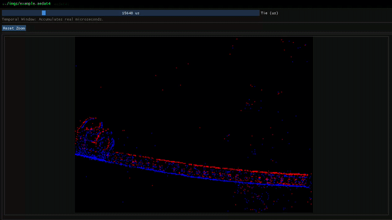

# 🚀 riv (Research Image Viewer)

**riv** is an interactive High Dynamic Range (HDR) and Polarized image viewer developed in **C++**. It utilizes **OpenGL** for hardware-accelerated rendering, **OpenCV** for robust image processing, and features a modern, clean graphical interface built with **Dear ImGui**. 

The engine natively decodes raw polarization data alongside standard HDR formats, providing an optimized multi-panel monolithic grid layout for advanced computer vision analysis.

---

## ✨ Key Features

* **🎨 Separated Global Tonemapping:** Exposure and tone mapping remain perfectly stable. Zooming or panning around doesn't alter the brightness or contrast of the viewed region. The original raw data remains unaltered during inspection.
* **📸 Native Polarization Decoding:** Automatically detects and unpacks raw polarization mosaic formats (`.raw`)
* **🧩 Monolithic Multi-Panel Grid:** Splits and computes polarized mosaics into 4 standard polarization channels ($0^\circ, 45^\circ, 90^\circ, 135^\circ$), rendering a synchronized 6-panel workspace that includes real-time calculation of:
  * **DoLP** (Degree of Linear Polarization) mapped via `COLORMAP_JET`.
  * **AoLP** (Angle of Linear Polarization) mapped via `COLORMAP_HSV`.
* **🎯 Scroll Zoom:** Advanced UV coordinate tracking that keeps the exact pixel under your cursor in focus while zooming, fixed against integer truncation traps. Works seamlessly across all sub-panels in unison.
* **📦 Interactive BBox Selection:** Right-click and drag to create a selection box with a dedicated floating contextual menu to apply custom actions over that region.
* **🔍 Auto-Range Dynamic Colormap:** Automatically re-centers and scales the colormap radius based on the exact localized minimum and maximum HDR values inside your selection.
* **📁 Directory Navigation:** Load entire folders and seamlessly navigate through sequences of HDR images without leaving the application.
* **👁️ Real-time Pixel Matrix Overlay:** Deep zooming automatically displays a readable sub-grid showing the **precise, unaltered raw float values (up to 4 decimal places)** instead of post-processed LDR values. Text contrast adapts dynamically to the background luminance.
* **🖱️ Custom Precision Cursor:** Aesthetic replacement of the default system cursor with a reactive crosshair integrated directly into the viewport.

---


## 📷 Example Visualizations
### Polarization visualization workspace

Raw polarization mosaics are automatically decoded into a synchronized 6-panel layout, displaying the four polarization angles together with **AoLP** and **DoLP** computed in real time for analysis.


---
### HDR visualization with global tonemapping

The viewer preserves the global dynamic range of the original HDR image while applying real-time tonemapping for display. Zooming or panning does not affect exposure, brightness, or contrast, allowing accurate inspection of the original scene radiance.

<p align="left">
  
</p>

---

### Video playback

The viewer also supports video playback.


---

### 3D Visualizer

The viewer also supports 3D models visualization. The following formats are supported:

* .obj
* .ply
* .pcd


---

### Events (.aedat4) playback

The viewer also supports events playback in a format compatible with [dv-processing](https://github.com/inivation/dv-processing). This include a slider to control the timestamp of the event stream.




## 🎮 Controls & Interface Guide

### 🖱️ Mouse Bindings

| Control / Action | Input (Mouse) | Description |
| :--- | :--- | :--- |
| **Zoom to Cursor** | Scroll Up / Down 🖱️ | Smoothly zooms in or out using the current mouse position as the dynamic pivot anchor. |
| **Canvas Panning** | Left Click + Drag 🖱️ | Drags and pans the viewport across the image safely clamped inside the original resolution bounds. |
| **Region Selection (BBox)** | Right Click + Drag 🖱️ | Draws a green selection box on the canvas. Releasing it unfolds a contextual action window. |
| **Pixel Highlight** | Mouse Hover | Hovering individual pixels at high zoom factors displays an isolated green border and its color properties. |

### ⌨️ Keyboard Shortcuts

| Shortcut | Action | Description |
| :--- | :--- | :--- |
| `A` | **Hard Reset Everything** ⚠️ | **Master Reset:** Restores the original full image crop, clears any active colormap range, switches back to Reinhard mode, resets polarized buffers, and sets all tonemapping sliders to factory defaults. |
| `R` | **Reset Range** | Clears the localized AutoRange colormap and restores the full original dynamic range. |
| `Z` | **Reset Zoom** | Resets zoom to the original image boundaries. |
| `S` | **Cycle Color Spaces** | Instantly toggles and transitions the active color space rendering properties. |
| `Q` | **Exit App** | Instantly closes the visualizer window safely. |
| `←` / `→` | **File Navigation** | Switches to the previous or next image available in the loaded directory sequence. |
| `SPACE` | **Play/Pause* | Only works in video playback mode. Toggles between playing and paused states.
| `F` | **Faces (3D)** | Toggles between wireframe and solid rendering modes.
---

## 🎛️ Contextual Actions & Parameters

### 🔲 BBox Floating Menu
When you perform a **Right-Click selection**, a reactive box will display two fast actions:
* **Zoom:** Crops and scales the viewport strictly to the framed region coordinates.
* **AutoRange:** Analyzes the raw HDR matrix inside the bounding box, extracts the `min` / `max` values, and normalizes the visualization scale automatically.

### 🎚️ Tonemapping Operators
The application natively implements three of the most representative tone mapping operators used in the computational photography industry. Changing operators **only affects visualization**, leaving HUD pixel readings intact:
* **Reinhard:** `Gamma`, `Intensity`, `Light Adapt`, `Color Adapt`
* **Drago:** `Gamma`, `Saturation`, `Bias`
* **Mantiuk:** `Gamma`, `Scale`, `Saturation`

---

# 🔧 Requirements & Installation

## Supported Platforms

**RIV** has been tested and works on:

- Ubuntu 22.04 LTS
- macOS (Apple Silicon / M1 / M2)

⚠️ Windows support is currently **not officially tested**, so compatibility is not guaranteed.

---

# 1. Install Dependencies

## Ubuntu 22.04

Install the required development packages:

```bash
sudo apt update

sudo apt install \
    build-essential \
    cmake \
    libopencv-dev \
    libopenexr-dev \
    libglfw3-dev \
    libgl1-mesa-dev \
    xorg-dev
```

---

## macOS (Apple Silicon)

Using Homebrew:

```bash
brew install cmake opencv openexr glfw
```

---

# 2. Clone the Repository

```bash
git clone https://github.com/arielz001/riv.git
cd riv
git submodule update --init --recursive
```

---

# 3. Build from Source

Create the build directory:

```bash
mkdir build
cd build
```

## Standard Build

If you **do not need event-camera support**:

```bash
cmake ..
make
```

---

# Optional: Event-Based Camera Support (.aedat4)

This section is only required if you want to open **`.aedat4` files** from event-based cameras.

Currently supported **only on Ubuntu**.

---

## Install dv-processing

```bash
sudo add-apt-repository ppa:ubuntu-toolchain-r/test
sudo add-apt-repository ppa:inivation-ppa/inivation

sudo apt update

sudo apt install dv-processing
sudo apt install libeigen3-dev -y
```

---

## Install clang-18

Some versions of `dv-processing` may require **clang-18**.

Install it with:

```bash
curl -fsSL https://hexmos.com/ipm-install | bash
ipm i clang-18
```

During installation, press **Enter** to accept the default options.

---

## Build with dv-processing

```bash
CC=clang-18 CXX=clang++-18 cmake ..
make
```

---

# Optional Installation

To install `riv` system-wide:

```bash
sudo make install
```

---

# Quick Start

### Standard build

```bash
git clone https://github.com/arielz001/riv.git
cd riv
git submodule update --init --recursive

mkdir build
cd build

cmake ..
make
```

---

### Build with `.aedat4` support

After installing `dv-processing` and `clang-18`:

```bash
CC=clang-18 CXX=clang++-18 cmake ..
make
```
## Usage (if you installed with sudo make install, else use ./build/bin/riv)

Run **riv** by passing an image file or a directory containing images:

```bash
riv <image_or_folder>
```

Or you can use more than one image at the same time:

```bash
riv imgs/pingpong.exr imgs/normals.exr
```
### Examples

Open a single HDR image:

```bash
riv imgs/pingpong.exr
```

Open a single polarized image:

```bash
riv imgs/image.raw
```

Open a 3D model:

```bash
riv models/bunny.obj
```

Open a folder and browse through all images with ← / →:

```bash
riv imgs
```


---

## Related project

riv is fully inspired by [vpv](https://github.com/kidanger/vpv), a popular Image viewer for Linux and MacOS.


## To cite this software

```
@misc{riv2026,
  author       = {arielz001},
  title        = {riv: Research Image Visualizer},
  year         = {2026},
  publisher    = {GitHub},
  journal      = {GitHub repository},
  howpublished = {\url{[https://github.com/arielz001/rev](https://github.com/arielz001/rev)}}
}```
